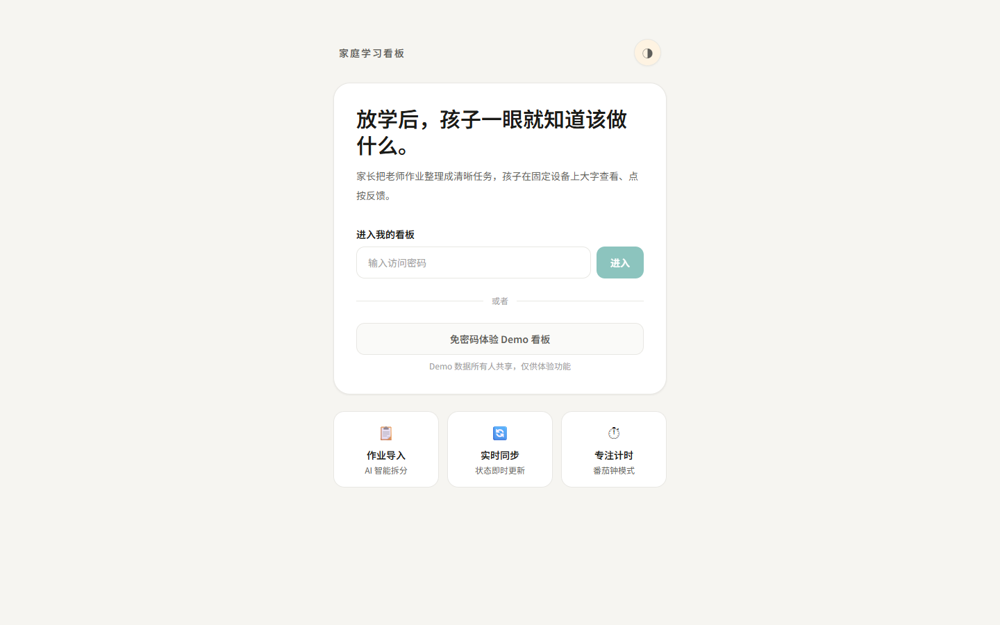
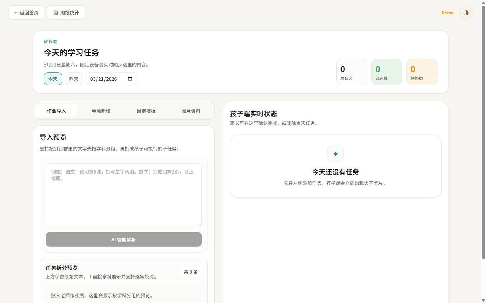
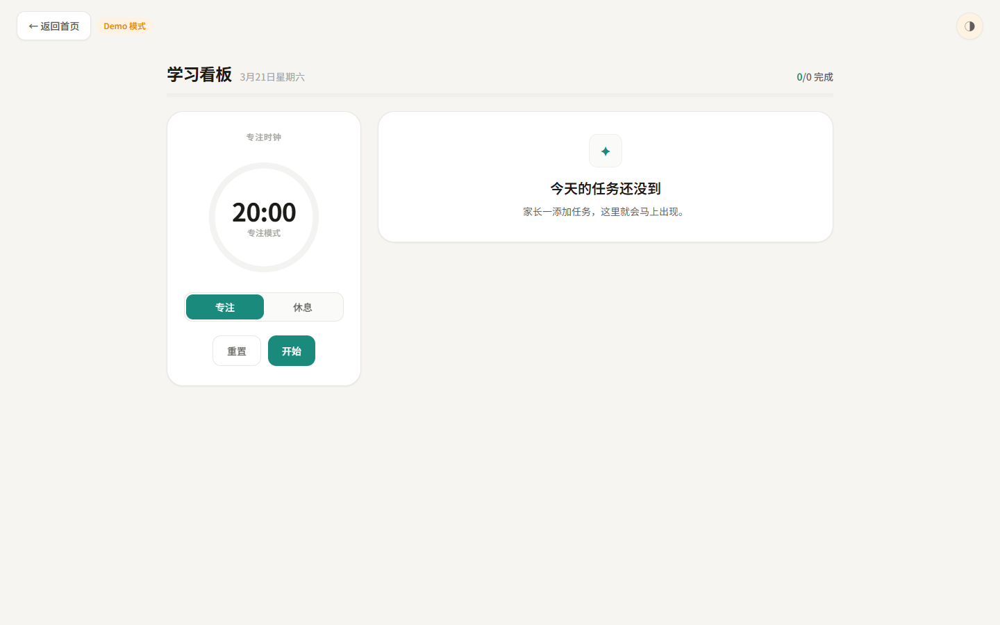

# 家庭学习看板

面向小学生家庭的作业协同 Web App。家长整理任务，孩子在 iPad 上大字查看、点按反馈，家长端实时同步。

## 项目截图

| 首页入口 | 家长端 | 孩子端 |
|:---:|:---:|:---:|
|  |  |  |
| 孩子看板直达 / 家长密码进入 | 作业导入、AI 解析、实时状态 | 番茄钟、任务卡片、图片资料 |

## 功能特性

- 家长端创建和管理今日任务
- 孩子端查看任务并更新状态，家长端实时同步
- 老师作业文本导入 + AI 智能解析（自动识别学科、拆分子任务）
- 学校作业 / 课外练习分类查看与管理
- AI 今日作战计划（孩子端个性化鼓励 + 做作业顺序建议）
- AI 人设自定义（定义 AI 生成内容的语气和风格）
- “每天固定任务”模板并一键加入当天任务
- 孩子端番茄钟计时器（专注 20 分钟 + 休息 5 分钟）
- 老师图片资料全屏滑动查看
- 学科优先级排序（语文→数学→英语）
- 访问保护：密码门 + board_id 数据隔离
- PWA 支持，iPad 桌面图标直达孩子端

## 技术栈

- Next.js App Router
- TypeScript
- Tailwind CSS
- Supabase
- Vercel

## 环境变量

先复制模板文件：

```bash
cp .env.example .env.local
```

`.env.local` 需要填写：

```env
NEXT_PUBLIC_SUPABASE_URL=https://your-project-ref.supabase.co
NEXT_PUBLIC_SUPABASE_ANON_KEY=your_public_client_key
NEXT_PUBLIC_DEFAULT_BOARD_ID=family-demo
BOARD_PASSWORD=your_access_password
```

说明：

- `NEXT_PUBLIC_SUPABASE_URL`：Supabase 项目的 Project URL
- `NEXT_PUBLIC_SUPABASE_ANON_KEY`：前端公开 key，可使用 anon public key 或新版 publishable key
- `NEXT_PUBLIC_DEFAULT_BOARD_ID`：私有看板 ID，设一个不容易猜到的值
- `BOARD_PASSWORD`：访问私有看板的密码（首页输入密码才能进入）

## Supabase 初始化

### 1. 创建项目

在 Supabase 控制台创建一个新项目。

### 2. 执行 migrations

按顺序在 Supabase `SQL Editor` 中执行以下文件：

1. [001_init_tasks.sql](supabase/migrations/001_init_tasks.sql)
2. [002_add_subject_to_tasks.sql](supabase/migrations/002_add_subject_to_tasks.sql)
3. [003_add_task_templates.sql](supabase/migrations/003_add_task_templates.sql)
4. [004_harden_tasks_schema.sql](supabase/migrations/004_harden_tasks_schema.sql)
5. [005_add_task_attachments.sql](supabase/migrations/005_add_task_attachments.sql)
6. [006_add_ai_config.sql](supabase/migrations/006_add_ai_config.sql)
7. [007_add_ai_soul.sql](supabase/migrations/007_add_ai_soul.sql)
8. [008_add_task_category.sql](supabase/migrations/008_add_task_category.sql)

这些 migration 会创建或补齐：

- `public.tasks`
- `public.task_templates`
- `public.task_attachments`
- `task_status` enum
- `subject` 字段
- `template_id` 字段
- `updated_at` trigger
- RLS policy
- 常用索引与基础约束
- `teacher-attachments` storage bucket 与公开读写策略
- `public.ai_config` AI 服务配置表（含 `soul` 人设描述字段）
- `tasks.category` 字段与分类索引（学校作业 / 课外练习）

### 3. 建议执行后的快速检查

可以在 SQL Editor 中运行以下 SQL 确认表结构已就绪：

```sql
select * from public.tasks limit 1;
select * from public.task_templates limit 1;
select * from public.task_attachments limit 1;
```

## 本地启动

1. 安装依赖

```bash
npm install
```

2. 配置 `.env.local`

参考上面的环境变量说明填写 Supabase URL 和公开 key。

3. 启动开发环境

```bash
npm run dev
```

4. 打开页面

- 首页：`http://localhost:3000`
- 家长端：从首页点击“进入家长端”，输入 `BOARD_PASSWORD`
- 孩子端：从首页点击“进入孩子看板”
- 也可以直接访问：
  - `http://localhost:3000/parent`
  - `http://localhost:3000/child`

如果 3000 端口被占用，请以终端输出的实际端口为准。

## 本地验收建议

建议至少验证以下流程：

1. 家长端新增任务
2. 孩子端能立即看到新增任务
3. 孩子端更新状态
4. 家长端实时同步看到状态变化
5. 刷新 `/parent` 和 `/child` 后数据仍然存在
6. 家长端导入老师作业文本，确认能按学科拆分
7. 家长端固定任务模板可保存并一键加入当天任务
8. 家长端上传老师图片资料，确认不会生成独立任务
9. 孩子端在对应学科下点击“查看参考图片”可以打开弹层
10. `parent_only` 或 `visible_to_child = false` 的图片不会出现在孩子端

## 数据模型概览

### tasks

核心字段：

- `board_id`: 家庭或设备对应的看板标识
- `due_date`: 日期维度，MVP 按天管理
- `subject`: 学科信息，用于导入分组和孩子端展示
- `template_id`: 固定任务模板来源 ID，可为空
- `title`: 任务标题
- `details`: 任务说明
- `status`: `pending` / `in_progress` / `done_by_child` / `needs_help` / `confirmed_by_parent`
- `source`: `manual` / `imported` / `template`
- `category`: `school` / `extra`
- `last_updated_by`: `parent` / `child`

### task_templates

核心字段：

- `board_id`: 看板标识
- `subject`: 学科
- `title`: 模板标题
- `details`: 模板备注
- `is_active`: 是否启用
- `sort_order`: 模板排序

### task_attachments

老师图片资料附件，独立于任务本体，不参与任务状态流转。

核心字段：

- `board_id`: 看板标识
- `due_date`: 日期维度
- `subject`: 学科归属
- `storage_path`: Supabase Storage 路径
- `public_url`: 图片公开地址
- `note`: 家长补充的一句说明
- `role`: `reference` / `instruction` / `parent_only`
- `visible_to_child`: 是否显示给孩子端
- `sort_order`: 同一学科下的图片顺序

## AI 智能解析配置

导入预览支持 AI 智能解析作业文字，可在家长端顶栏「⚙ AI 设置」中配置。

### 支持的服务商

| 服务商 | 可用模型 |
|---------|----------|
| OpenAI | GPT-4o Mini, GPT-4o, GPT-4.1 Mini, GPT-4.1 |
| Anthropic (Claude) | Claude Sonnet 4, Claude Haiku 3 |
| DeepSeek | DeepSeek Chat, DeepSeek Reasoner |
| 智谱 AI (GLM) | GLM-4 Flash, GLM-4 Plus |
| 通义千问 (Qwen) | Qwen Turbo, Qwen Plus, Qwen Max |

### 配置方式

1. 确保已执行 `006_add_ai_config.sql` 和 `007_add_ai_soul.sql`
2. 在家长端顶栏点击「⚙ AI 设置」
3. 选择服务商和模型
4. 填入对应服务商的 API Key
5. （可选）填写 AI 人设描述，定义 AI 生成内容的语气和风格
6. 保存即可

API Key 存储在 Supabase 数据库中，前端仅显示脱敏值。所有 AI 调用走服务端 API Route，不暴露在浏览器中。

如果不想用界面配置，也可以在 Vercel 环境变量中设置 `OPENAI_API_KEY` 作为 fallback。

## 访问保护

项目采用 **孩子看板直达 + 家长端密码验证 + board_id 隔离** 方案：

- **孩子看板**：首页可直接进入，适合家里固定设备使用
- **家长端**：首页点击后输入密码进入，验证成功后写入 httpOnly cookie（90 天有效）
- **board_id**：任务、图片资料、AI 配置等数据继续按 board 隔离
- **PWA**：iPad 桌面图标直接打开 `/child`，无参数时自动使用环境变量中的私有 board_id

密码通过 `BOARD_PASSWORD` 环境变量设置。

## 部署到 Vercel

1. 将代码推送到 GitHub
2. 在 Vercel 中导入该仓库
3. 在 Vercel 项目设置中配置以下环境变量：

```env
NEXT_PUBLIC_SUPABASE_URL=...
NEXT_PUBLIC_SUPABASE_ANON_KEY=...
NEXT_PUBLIC_DEFAULT_BOARD_ID=your-private-board-id
BOARD_PASSWORD=your-password
```

4. 触发部署

## 常用命令

```bash
npm run dev
npm run lint
npm run build
```

## 项目结构

- `src/app`：路由与页面
- `src/components`：家长端与孩子端核心界面
- `src/lib`：Supabase、日期、任务拆分等基础能力
- `src/types`：领域类型
- `supabase/migrations`：数据库初始化与补充迁移

## 说明

本项目专为小学生家庭场景设计，孩子端针对 iPad 优化，界面克制平静，不分散注意力。
